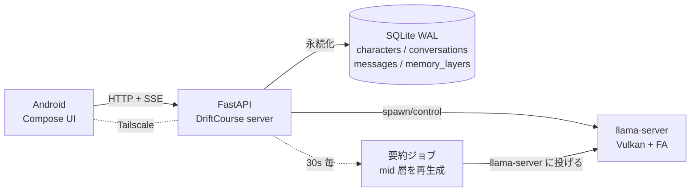

<div align="center">

# DriftCourse

### ミニ PC を推論サーバに、スマホを薄いクライアントにした完全ローカル型 AI チャット

[](server/)
[](android/)
[](android/)
[](https://github.com/ggml-org/llama.cpp)
[](https://huggingface.co/Qwen/Qwen3-30B-A3B-Instruct-2507)
[](LICENSE)

**家の LAN を出ない。クラウドを使わない。スマホのバッテリーと熱の制約も受けない。**

</div>

## 概要

[DRIFT](https://github.com/cUDGk/drift) の「完全ローカル / キャラ一貫性 / 長期記憶」の方針を踏襲しつつ、推論だけをミニ PC に逃がした構成。スマホ側は Compose の薄いクライアントで、llama.cpp は載せない。通信は LAN 内、または Tailscale 経由。

## なぜスマホでやらないか

8GB LPDDR5X (Xiaomi 13T) の実効帯域 ~25 GB/s では 1.5B Q4 でも 20 tok/s が限界、7B 以上は実用速度に届かない。熱でサーマルスロットリング、バッテリもゴリゴリ減る。30B MoE や 32B dense は RAM 的に起動すら不可。

ミニ PC (Ryzen 9 7940HS / Radeon 780M / 64GB DDR5) に投げれば:

| 項目 | 実測 / 状態 |
|---|---|
| メインモデル | Qwen3-30B-A3B-Instruct-2507 (Q4_K_M, 18.6GB) |
| 推論速度 | 23 tok/s (Vulkan + Flash Attention + q8_0 KV) |
| 多ターン会話 | `cache_prompt` + `--cache-reuse 256` で prefill 再利用 |
| 要約ジョブ | 古いターンを中期メモリに自動で畳む (30s ポーリング) |
| 端末の熱・電池 | 無影響 (UI 描画と HTTP だけ) |

## 特徴

| 機能 | 内容 |
|---|---|
| 3 タブ構成 | モデル作成 / モデル一覧 / 対話一覧 |
| 素のモデル | 対話一覧の「+」で即チャット、内部で隠し匿名キャラを自動用意 |
| モデル作成 | 手動フォーム、または **AI と対話して作る** (JSON 抽出 → プリフィル) |
| モデル編集 | 名前・人物説明・性格・状況・初回挨拶・例会話・記憶 の 7 項目。AI 対話で編集も可 |
| アイコン | スマホのフォトピッカから設定。**GIF はアニメを保持**、静止画は 256px JPEG に正規化 |
| ゴーストモード | キャラ付きのまま会話を**保存しない**モード |
| 階層メモリ | キャラ記憶 / 長期 / 中期 / 直近 の 4 層。手動編集もタブで可能 |
| 自動要約 | recent のトークン数が閾値を越えたら mid に畳み、古い raw ターンは再送しない |
| 認証 | Bearer トークン (初回起動で `.drift-token` 生成、QR 等でスマホに渡す想定) |
| 通信 | LAN 内 HTTP + SSE、外出時は Tailscale (tailnet IP で直叩き、暗号化は WireGuard 任せ) |

## アーキテクチャ



## API (サーバ側)

```
GET  /health
GET  /models                        モデル GGUF 一覧 + 現在ロード中
POST /models/load                   subprocess 再起動してモデル差替

GET/POST            /characters
GET/PATCH/DELETE    /characters/:id

GET/POST            /conversations
GET/DELETE          /conversations/:id
GET/POST            /conversations/:id/messages      POST は SSE でストリーム
GET/PATCH           /conversations/:id/memory[/:layer]
POST                /conversations/:id/summarize     手動要約トリガ (デバッグ)

POST /v1/chat                       ステートレス SSE (ゴースト / AI 作成用)
```

認証: `Authorization: Bearer <token>` (health だけ認証不要)。

## インストール

### ミニ PC 側 (Windows)

```bash
# llama.cpp Vulkan ビルドを展開 (例: C:\tools\llama-b8851\)
# GGUF を C:\Users\user\drift-course\models\ に配置

cd C:\Users\user\drift-course\server
python -m venv .venv
.venv\Scripts\pip install -e .
cp .env.example .env        # 実機のパスに合わせて編集
.venv\Scripts\python -m drift_course.main
```

初回起動時に `.drift-token` が生成される。これをスマホ側に渡す。

### Android 側

`android/` を Android Studio で開くか、コマンドでビルド:

```bash
cd android
./gradlew assembleDebug
adb install -r app/build/outputs/apk/debug/app-debug.apk
```

起動後、設定画面でサーバ URL (`http://<tailnet-or-lan-ip>:8787`) と Bearer トークンを入力。

## 推論パラメータ

[llm-exp-runbook](https://github.com/cUDGk/llm-exp-runbook) / [llm-exp-chatcache](https://github.com/cUDGk/llm-exp-chatcache) の実測を反映:

| 項目 | 値 | 根拠 |
|---|---|---|
| backend | Vulkan | CPU 比 +23% (runbook E1) |
| `-fa on` | Flash Attention | 微増、破綻なし |
| 量子化 | Q4_K_M | Q5_K_M より速く精度差小 (E2) |
| KV cache | q8_0 (k/v) | f16 と同速、VRAM 半減 (E3) |
| メイン | Qwen3-30B-A3B MoE | 3B active、A3B で 7B Dense の 2× (E4) |
| `cache_prompt` | on | 多ターンで prefill 再利用 |
| `--cache-reuse` | 256 | 部分マッチでも再利用 |
| draft spec | **無効** | Qwen3 系の 0.6B GGUF 不在、Qwen2.5-0.5B との組合せは tokenizer ズレで逆に遅化 |

## ディレクトリ構成

```
drift-course/
├── CONCEPT.md          — 設計方針 / 将来分岐
├── server/             — Python / FastAPI
│   └── drift_course/
│       ├── main.py            FastAPI app + lifespan
│       ├── llama_proc.py      llama-server subprocess 管理
│       ├── db.py              SQLite スキーマ + CRUD
│       ├── summarizer.py      自動要約ジョブ
│       ├── auth.py            Bearer トークン検証
│       └── routes/            health / models / characters / conversations / chat
└── android/            — Kotlin / Jetpack Compose
    └── app/src/main/java/com/driftcourse/app/
        ├── net/               HTTP / SSE / DTO / システムプロンプト合成
        ├── settings/          DataStore (server_url, token)
        └── ui/                各画面 + ViewModel + テーマ
```

## 関連リポジトリ

- [cUDGk/drift](https://github.com/cUDGk/drift) — 元の DRIFT コンセプト
- [cUDGk/llm-android](https://github.com/cUDGk/llm-android) — オンデバイス推論実装 (UI の流用元)
- [cUDGk/llm-exp-runbook](https://github.com/cUDGk/llm-exp-runbook) — backend / 量子化 / MoE 実測
- [cUDGk/llm-exp-chatcache](https://github.com/cUDGk/llm-exp-chatcache) — cache_prompt + spec decode の多ターン実測

## ライセンス

MIT © 2026 cUDGk
